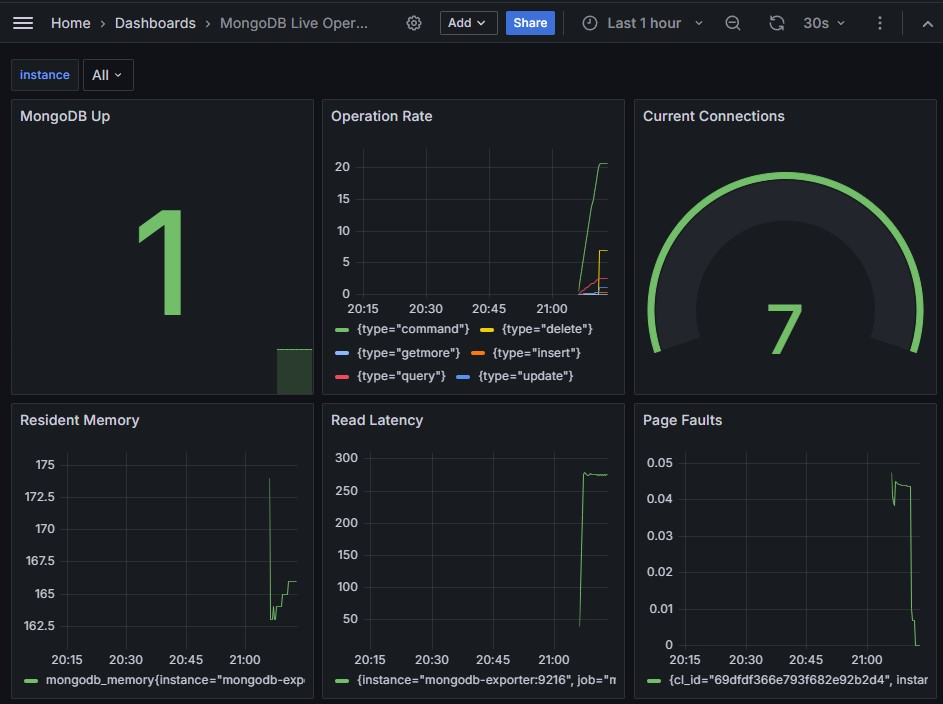
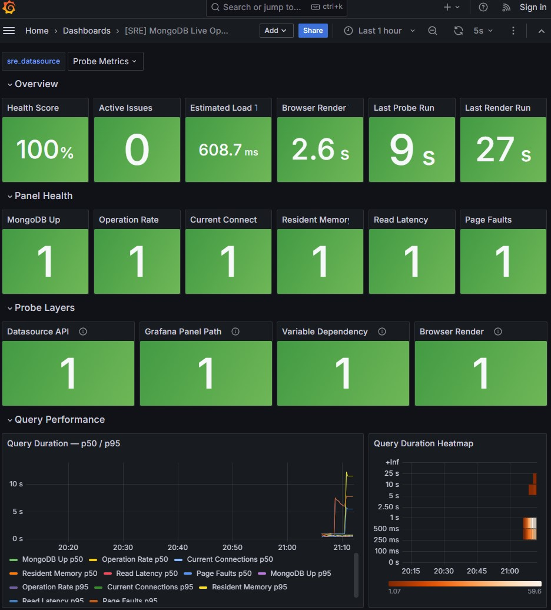
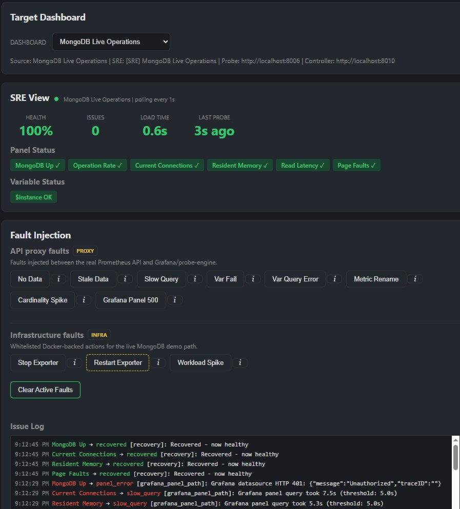

# Dashboard SRE

Monitor the user experience of a Grafana dashboard. Given a dashboard JSON, this service:

1. **Probe engine** — actively checks every panel through both the raw datasource API and Grafana's panel request path, then reports NO_DATA, STALE_DATA, SLOW_QUERY, PANEL_ERROR, VAR_RESOLUTION_FAIL, VARIABLE_QUERY_ERROR, CARDINALITY_SPIKE, and more.
2. **Meta-dashboard** — a Grafana JSON you can import to see the health of your dashboard at a glance.
3. **Alert rules** — Grafana Alerting YAML you can provision directly.

---

## Documentation

Use these docs as the current source of truth:

- `README.md` — setup, demo flow, and day-to-day usage
- `ARCHITECTURE.md` — system design and data flow
- `AGENTS.md` - repository workflow guidance for coding agents
- `BROWSER_RENDER_PROBE_PLAN.md` - browser render probe implementation notes and future render-fault follow-up

These files are kept only as historical context:

- `DASHBOARD_SRE_BRIEF.md` — original product brief

If an archival doc disagrees with the code or the active docs, trust the code and the active docs.

---

## Quick start

```bash
docker compose up --build
```

Then open **http://localhost:8080/simulator.html** in your browser.

| Service | URL | Purpose |
|---|---|---|
| **Grafana** | http://localhost:3000 | Real Grafana with provisioned dashboards + alerts |
| Demo UI | http://localhost:8080/simulator.html | Dashboard selector + fault injection |
| Service probe engine | http://localhost:8000/health | Service Health JSON health summary |
| MongoDB probe engine | http://localhost:8002/health | MongoDB Operations JSON health summary |
| MongoDB Atlas probe engine | http://localhost:8004/health | MongoDB Atlas System Metrics JSON health summary |
| MongoDB Live probe engine | http://localhost:8006/health | Live local MongoDB JSON health summary |
| Fault controller | http://localhost:8010/-/healthy | Browser-facing fault delegation API |
| Browser render probe | http://localhost:8012/health | Playwright-based Grafana render health summary |
| Service mock Prometheus | http://localhost:9090/-/healthy | Service metric backend + scoped fault state |
| MongoDB mock Prometheus | http://localhost:9093/-/healthy | MongoDB metric backend + scoped fault state |
| MongoDB Atlas mock Prometheus | http://localhost:9095/-/healthy | Atlas-style MongoDB metric backend + scoped fault state |
| MongoDB Live Prometheus | http://localhost:9097 | Prometheus scraping the live Mongo exporter |
| MongoDB Live fault proxy | http://localhost:9098/-/healthy | Faultable Prometheus API proxy for the live Mongo path |
| Prometheus | http://localhost:9091 | Real Prometheus scraping all probe engines |

---

## Static demo

The screenshots below show the end-to-end flow on the **MongoDB Live Operations** path. The same pattern applies to the Service Health and Atlas demo targets too: a real Grafana dashboard, a generated SRE dashboard for that dashboard, and a simulator that injects faults and shows the resulting diagnosis.

### Source dashboard in Grafana



### Generated SRE dashboard in Grafana



### Simulator with fault injection and issue log



---

## Demo walkthrough

The demo UI has three sections:

- **Target dashboard** - choose Service Health, MongoDB Operations, MongoDB Atlas System Metrics, or MongoDB Live Operations. The selector switches both the SRE health endpoint and the fault surface.
- **SRE view** — polls the selected probe engine every 5s. Shows health score, canonical issue count, per-panel badges, variable badges, and a scrolling issue log with the detection path for each issue event.
- **Fault injection** — grouped fault classes. Mock faults mutate synthetic backends, API proxy faults mutate the live Prometheus API response, and Infrastructure faults are visible but disabled in this MVP. Fault tooltips separate the origin of the fault from the SRE layer expected to catch it.

**Try it:**
1. Click a fault button (e.g. "No Data").
2. Watch the SRE health score drop within 30s.
3. Open the selected source dashboard in Grafana to inspect the real Grafana dashboard degradation.
4. Click "Clear All" — everything returns to green within 30s.

### Grafana (real dashboards)

Open **http://localhost:3000** (no login required). Eight dashboards are pre-provisioned:

- **Service Health** — the real Grafana dashboard with live panels powered by the mock Prometheus
- **[SRE] Service Health** — the meta-dashboard showing probe results from real Prometheus
- **MongoDB Operations** — a MongoDB operational dashboard powered by an isolated mock Prometheus
- **[SRE] MongoDB Operations** — the meta-dashboard generated from the MongoDB source dashboard
- **MongoDB Atlas System Metrics** — normalized from Grafana dashboard 19654, the MongoDB Atlas system metrics sample dashboard for the official Atlas Prometheus integration
- **[SRE] MongoDB Atlas System Metrics** — the meta-dashboard generated from the Atlas source dashboard
- **MongoDB Live Operations** — a local MongoDB workload scraped through Percona MongoDB exporter, Prometheus, and the faultable API proxy
- **[SRE] MongoDB Live Operations** — the meta-dashboard generated from the live Mongo source dashboard

Each source dashboard has its own alert group. Inject a fault in the simulator, then check the selected meta-dashboard and Alerting page in Grafana to see the matching rules fire.

---

## MongoDB dashboard variants

The repo includes three MongoDB dashboard targets on purpose. They are not duplicates; each one tests a different level of realism.

| Target | What it proves | Data path | Fault style |
|---|---|---|---|
| **MongoDB Operations** | A simple custom Mongo dashboard can be parsed, probed, visualized, and alerted on end-to-end. | Synthetic MongoDB metrics from an isolated mock Prometheus. | Mock backend returns deterministic broken Prometheus responses. |
| **MongoDB Atlas System Metrics** | A more realistic imported/normalized Atlas-style Grafana dashboard works with the same probe and generator pipeline. | Synthetic Atlas-shaped metrics from an isolated mock Prometheus. | Mock backend returns deterministic broken Prometheus responses. |
| **MongoDB Live Operations** | The same SRE flow works against real MongoDB exporter data, not just synthetic fixtures. | Real local MongoDB -> Percona exporter -> Prometheus -> fault proxy. | Fault proxy mutates real Prometheus API responses without breaking MongoDB itself. |

Why we made all three:

- **Mock MongoDB Operations** is the smallest reliable Mongo demo. It is fast, deterministic, and good for testing expected dashboard failures without running real database infrastructure.
- **Mock MongoDB Atlas** exercises a more complex real-world dashboard shape: more variables, Atlas-style metric names, and imported-dashboard conventions. It helps catch parser, generator, and dashboard-template assumptions that the simple custom dashboard would miss.
- **MongoDB Live** proves the architecture is not limited to fake data. It runs a real MongoDB workload and exporter, then uses a Python fault proxy as a safe gateway in front of Prometheus so we can simulate user-visible dashboard failures while the underlying database keeps running.

Conceptually:

```text
mongodb
  Grafana/probe-engine -> mock-mongo-prometheus

mongodb_atlas
  Grafana/probe-engine -> mock-mongo-atlas-prometheus

mongodb_live
  Grafana/probe-engine -> fault-proxy-mongo-live -> prometheus-mongo-live -> mongodb-exporter -> mongo-live
```

The simulator is shared across all targets. It loads `demo/dashboard_targets.js`, switches the selected probe health URL, and sends fault requests through the fault controller. The SRE dashboards are also generated the same way for all targets: each probe engine exposes `/metrics`, the browser render probe exposes render metrics, shared Prometheus scrapes those metrics, and Grafana reads them through the `probe-metrics` datasource.

---

## Dashboard target registry

`dashboard_targets.yaml` is the source of truth for the demo targets. It defines each source dashboard, datasource, isolated service path, generated SRE dashboard, alert rules file, grouped fault classes, controller delegate endpoints, and affected Grafana surfaces.

After editing the registry, regenerate and verify the derived files:

```bash
python -m generator.dashboard_targets --write
python -m generator.dashboard_targets --check
```

The registry writer updates probe configs, generated SRE dashboards, alert rules, Grafana datasources, Prometheus scrape configs, and `demo/dashboard_targets.js`. It does not generate `docker-compose.yml`; Compose keeps the isolated services explicit and the checker validates that they match the registry.

Faults are grouped by class:

- `mock` - deterministic synthetic Prometheus responses.
- `proxy` - deterministic response mutations in front of a real Prometheus API.
- `infra` - whitelisted infrastructure actions. These are modeled and disabled in this MVP; no Docker-mutating controls are exposed.

Each simulator fault also carries `affected_layers` and `expected_sre_signals`. This keeps the UX honest: a fault can originate in a mock backend, an API proxy, or future infrastructure control, while the SRE signal can come from the raw `datasource_api`, the `grafana_panel_path`, `browser_render`, variable resolution, variable dependency impact, staleness, or cardinality checks.

---

## Layered SRE probes

The SRE health score is not allowed to stay green just because Prometheus answers raw instant queries. Generated Docker probe configs enable a Grafana panel-path layer that calls Grafana `/api/ds/query` with the target dashboard's datasource UID and a range-query payload. A panel is degraded if Grafana returns an HTTP error, a non-JSON plugin response, malformed JSON, empty frames, or frames with no values.

This catches the real failure class exposed by MongoDB Live: the raw datasource can be healthy while the user-facing Grafana panel has no data or a plugin error. In `/health`, panel entries now include a `layers` list so you can see cases like `datasource_api=healthy` and `grafana_panel_path=degraded`.

The new `panel_query_http_500` proxy fault proves that contract. It breaks only `POST /api/v1/query_range` for the targeted metric, so raw `GET /api/v1/query` stays healthy while Grafana-style panel queries fail and the SRE dashboard turns red.

The browser render probe is a separate Playwright service. It opens each real Grafana dashboard, scrolls through panels to trigger lazy rendering, and exports `dashboard_render_status`, `dashboard_render_time_seconds`, `dashboard_render_last_probe_timestamp`, and `dashboard_render_error_total`. These metrics are supplementary: they appear in the generated SRE dashboard and alerts, but they do not change the existing `/health` score from the probe engines.

Recent issue events are diagnosis-aware: a new event is logged when a panel changes from one failure diagnosis to another, such as `no_data` to `slow_query`, even if the panel never had a clean healthy cycle between them. Repeated probes of the same diagnosis do not create duplicate rows.

Variable faults intentionally split two different user-facing failures:

- `var_resolution_fail` returns successful empty responses from Prometheus label-values calls and Grafana's common variable-discovery path, `/api/v1/series`. The real Grafana dropdown loses its options, but Grafana may not show a red error if the request itself succeeded.
- `variable_query_error` returns HTTP 500 from those same variable-discovery endpoints. This models the harder failure where refreshing a Grafana variable should surface a query/dropdown error, and the SRE view reports `variable_query_error`.

When a failed variable is referenced by panel queries, SRE reports those panels as `blocked_by_variable` through the `variable_dependency` layer. This is intentionally not `no_data`: the underlying metric can still be healthy, but the dashboard query the user sees cannot be rendered with the failed variable. The generated SRE dashboard includes a **Variable Blast Radius** table for this fan-out.

---

## Fault injection via curl

```bash
# Inject a Service Health mock fault through the controller
curl -s -X POST http://localhost:8010/faults/inject \
  -H "Content-Type: application/json" \
  -d '{"target_key":"service","group_key":"mock","type":"no_data","target":"http_requests_total","duration_seconds":60}'

# Check active faults
curl -s "http://localhost:8010/faults/active?target_key=service"

# List fault types with descriptions
curl -s http://localhost:8010/faults/types

# Clear all faults
curl -s -X POST http://localhost:8010/faults/clear \
  -H "Content-Type: application/json" \
  -d '{"target_key":"service","target":"all"}'

# MongoDB mock path: same controller API, isolated backend
curl -s -X POST http://localhost:8010/faults/inject \
  -H "Content-Type: application/json" \
  -d '{"target_key":"mongodb","group_key":"mock","type":"no_data","target":"mongodb_op_counters_total","duration_seconds":60}'

# MongoDB Live path: proxy fault against real Prometheus responses
curl -s -X POST http://localhost:8010/faults/inject \
  -H "Content-Type: application/json" \
  -d '{"target_key":"mongodb_live","group_key":"proxy","type":"no_data","target":"mongodb_op_counters_total","duration_seconds":60}'

# MongoDB Live panel-path regression: raw datasource stays healthy, Grafana panel path fails
curl -s -X POST http://localhost:8010/faults/inject \
  -H "Content-Type: application/json" \
  -d '{"target_key":"mongodb_live","group_key":"proxy","type":"panel_query_http_500","target":"mongodb_op_counters_total","duration_seconds":60}'
```

Supported fault types: `no_data`, `stale_data`, `slow_query`, `metric_rename`, `cardinality_spike`, `var_resolution_fail`, `variable_query_error`, `panel_query_http_500`.

Notes on demo behavior:
- `metric_rename` currently surfaces as `no_data` in `/health` and probe metrics because both conditions produce the same empty Prometheus result in this demo stack.
- The demo UI is SRE/fault-injection only. Use Grafana **Service Health**, **MongoDB Operations**, **MongoDB Atlas System Metrics**, or **MongoDB Live Operations** for the real dashboard experience.
- Infrastructure faults are shown as a separate class but rejected by the controller with a disabled response in this MVP.

---

## Running without Docker (development)

**Terminal 1 — mock backend:**
```bash
cd mock_backend
pip install -r requirements.txt
uvicorn prometheus_api:app --port 9090
```

**Terminal 2 — probe engine:**
```bash
pip install -r probe/requirements.txt
DASHBOARD_PATH=demo/example_dashboard.json uvicorn probe.engine:app --port 8000
```

**Terminal 3 - fault controller:**
```bash
DASHBOARD_TARGETS_PATH=dashboard_targets.yaml FAULT_CONTROLLER_URL_MODE=local \
  uvicorn fault_controller.api:app --port 8010
```

**Browser:** open `demo/simulator.html` directly as a file, or serve it:
```bash
python -m http.server 8080 --directory demo
```

`demo/simulator.html` loads `demo/dashboard_targets.js`, which is generated from `dashboard_targets.yaml`.

---

## Port overrides

Copy `.env.example` to `.env` and edit:

```bash
MOCK_BACKEND_PORT=9090
MOCK_MONGO_PORT=9093
MOCK_MONGO_ATLAS_PORT=9095
PROBE_ENGINE_PORT=8000
PROBE_ENGINE_MONGO_PORT=8002
PROBE_ENGINE_MONGO_ATLAS_PORT=8004
PROBE_ENGINE_MONGO_LIVE_PORT=8006
MONGO_LIVE_PORT=27018
MONGODB_EXPORTER_PORT=9216
PROMETHEUS_MONGO_LIVE_PORT=9097
FAULT_PROXY_MONGO_LIVE_PORT=9098
FAULT_CONTROLLER_PORT=8010
BROWSER_RENDER_PROBE_PORT=8012
SIMULATOR_PORT=8080
```

---

## Generating outputs for your own dashboard

For a provisioned demo target, add a new entry to `dashboard_targets.yaml`, then run:

```bash
python -m generator.dashboard_targets --write
python -m generator.dashboard_targets --check
```

For one-off experiments, the lower-level generators can still be used directly:

```python
import json
from probe.parser import parse_dashboard
from generator.meta_dashboard import generate_meta_dashboard
from generator.alert_rules import generate_alert_rules

with open("your_dashboard.json") as f:
    dashboard = json.load(f)

panels, variables = parse_dashboard(dashboard)
meta = generate_meta_dashboard(dashboard, panels, variables)
alerts = generate_alert_rules(dashboard, panels, variables)

with open("meta_dashboard.json", "w") as f:
    json.dump(meta, f, indent=2)

import yaml
with open("alert_rules.yaml", "w") as f:
    yaml.dump(alerts, f)
```

Import `meta_dashboard.json` into Grafana via **Dashboards → Import**.
Place `alert_rules.yaml` in your Grafana provisioning directory (`/etc/grafana/provisioning/alerting/`).

---

## Architecture

```
Grafana Dashboard JSON
        │
        ▼
   parser.py ──→ PanelProbeSpec / VariableProbeSpec
        │
        ├──→ engine.py  (probe loop, 15s interval, concurrent)
        │       ├──→ query_probe.py      NO_DATA, QUERY_TIMEOUT, SLOW_QUERY, PANEL_ERROR
        │       ├──→ staleness_probe.py  STALE_DATA
        │       ├──→ variable_probe.py   VAR_RESOLUTION_FAIL, VARIABLE_QUERY_ERROR
        │       └──→ cardinality_probe.py CARDINALITY_SPIKE, METRIC_RENAME
        │       └──→ metrics.py  →  /metrics (Prometheus) + /health (JSON)
        │
        ├──→ generator/meta_dashboard.py  →  Grafana dashboard JSON
        └──→ generator/alert_rules.py     →  Grafana alerting YAML
```

**mock_backend/** — FastAPI app mimicking the Prometheus HTTP API with fault injection. The probe engine talks to it exactly as it would a real Prometheus instance.
